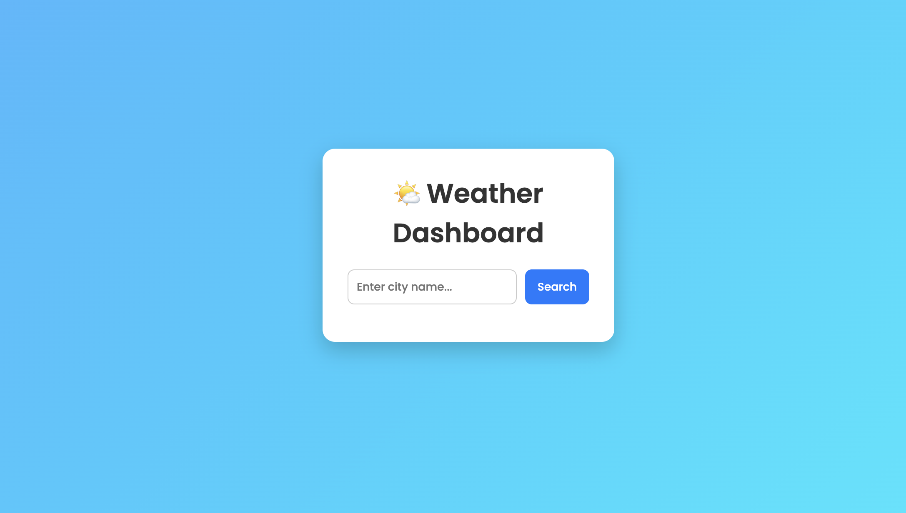

# Question-4

Explore the features of ES6 like arrow functions, callbacks, promises, async/await. Implement an application for reading the weather information from openweathermap.org and display the information in the form of a graph on the web page.

---

# Output

## Weather Dashboard

## Async / Await Usage

_await().png)

## Weather City Input

